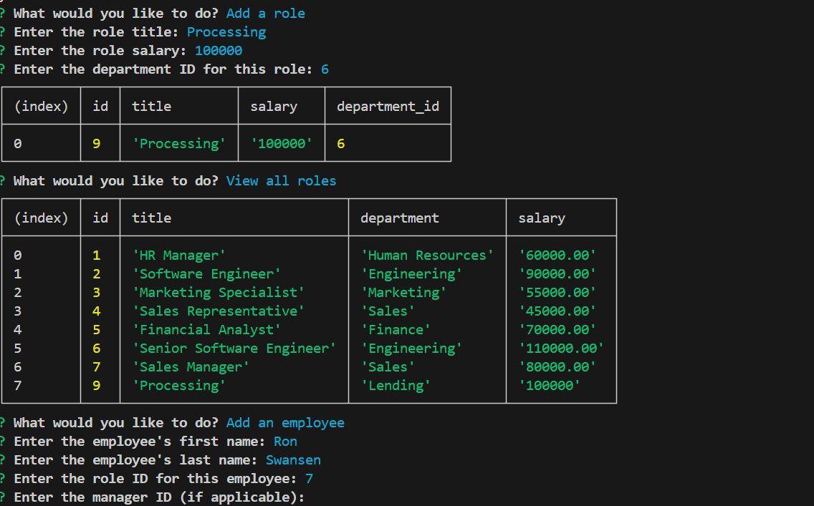

# Emloyee-Tracker-SQL

## Description
Welcome to the employe tracker, a place for your company to store all of your employees information in one place. You can view all departments, roles, and employees. If you need to update any of them, theres a feature for that as well!

## Technologies Used
Javascript, Inquirer, SQL, PG, Node modules.

## Installation
1. Clone the repository: git clone https://github.com/yourusername/employee-tracker-SQL.git
2. cd into the project

## Usage
1. Open your terminal
2. Create the database by entering psql -U and your database username
3. Enter your password
4. Enter this command \i db/schema.sql
5. Enter this command \i db/seeds.sql
6. Enter this command \q
7. Now start the prompts by entering node index.js

## Contributing
If you would like to contribute to this project, please fork the repository and submit a pull request with any changes.

## License
This project is not licensed.

## Links
Github: https://github.com/Betzaida96/employee-tracker-SQL

Demo Video: https://drive.google.com/file/d/1nfdz_23AcwjfITI7ZWZS07uWRqsNX7bW/view

## Photos

